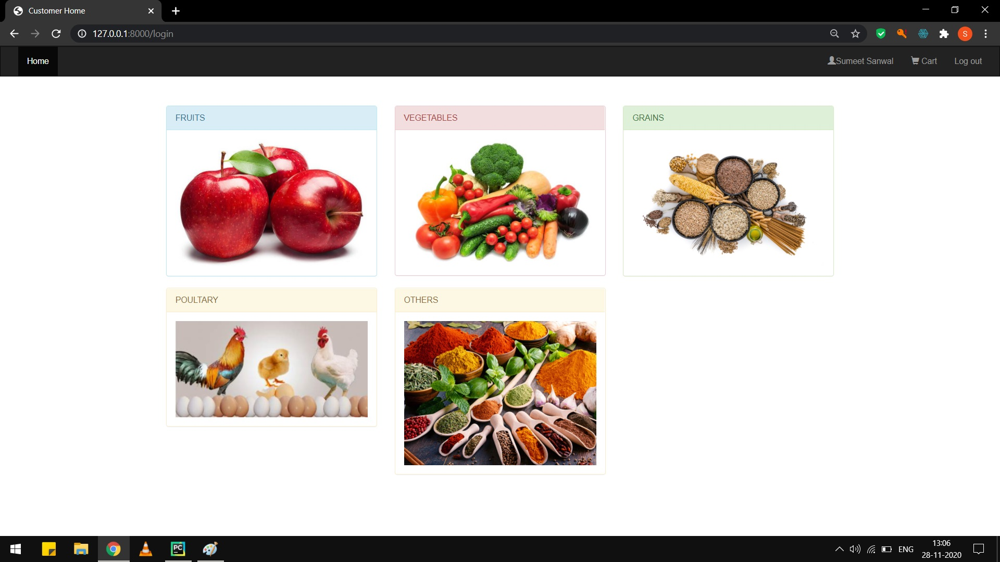
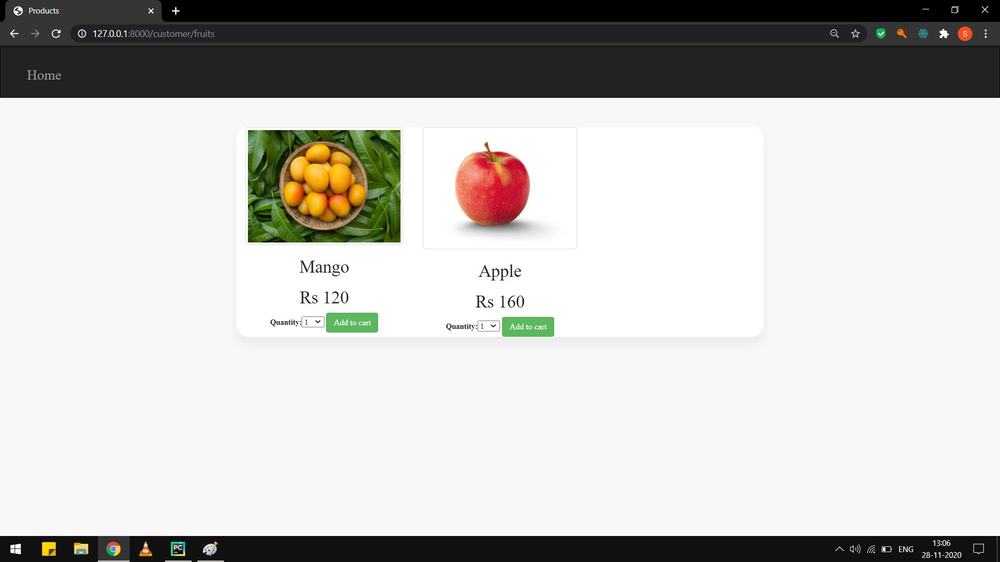
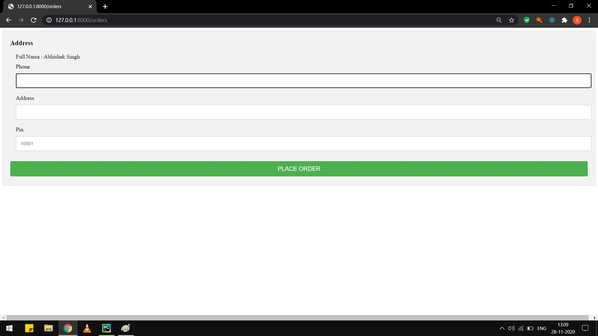
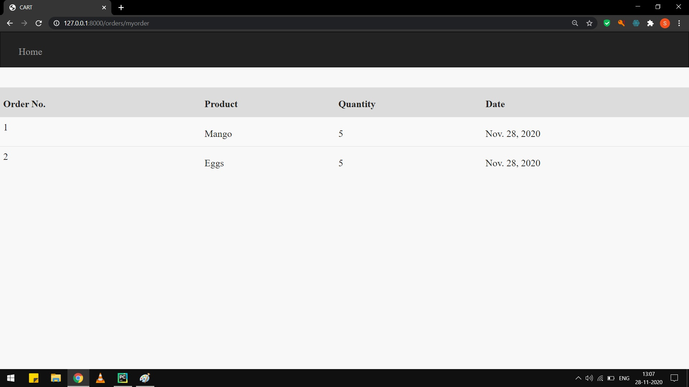

# Farmer-Ecomm

<h4>It is a project which allows farmers to sell their goods directly to customers (B2C Model). This allows to cut down the cost of middlemen men and hence allows farmers to profit more whereas customer to get fresh at cheaper prices. I also intent to add a machine learning algo that would help farmers get crop recommendations.</h4>

<b>Backend: Django</b> 
<b>Frontend: HTML,CSS,JS</b> 
<b>Database: Mysql</b>
  

